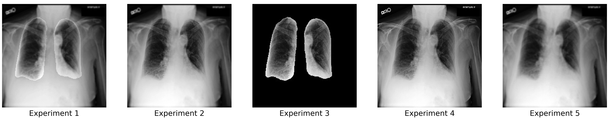
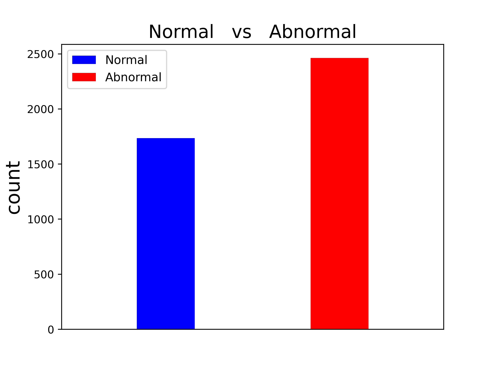

# Exploring Diagnostic Methodology for Pulmonary Edema Diagnosis in Patients with Congestive Heart Failure Using U-Net Based Architecture

### U-Net 기반 아키텍처를 활용한 울혈성 심부전 환자 폐부종 진단 방법론 연구

## 📝 Paper & Description
<b><a href="https://www.dbpia.co.kr/journal/articleDetail?nodeId=NODE11758380">📌 Paper Link</a></b>

[📌 Doby's Lab (Blog Description)](https://draw-code-boy.tistory.com/592)

## 📁 Dataset

1. <a href="https://physionet.org/content/mimic-cxr-jpg/2.0.0/">MIMIC-CXR-JPG - chest radiographs with structured labels</a>
2. <a href="https://physionet.org/content/chest-x-ray-segmentation/1.0.0/">Chest X-ray Dataset with Lung Segmentation v1.0.0</a>
3. <a href="https://physionet.org/content/mimic-cxr-pe-severity/1.0.1/">Pulmonary Edema Severity Grades Based on MIMIC-CXR v1.0.1</a>

## 💡 Research IDEA and GOAL

- 본 연구의 아이디어 기반이 되었던 뇌종양을 Segmentation하는 연구, <a href="https://ieeexplore.ieee.org/document/9199562">TSTBS</a>에서는 <u><b>의료진의 진단 과정</b></u>에 착안하여 아키텍처를 구성하였습니다. 이에 따라 Chest X-ray를 통해 Congestive Heart Failure(울혈성 심부전) 환자들의 Pulmonary Edema(폐부종) 진단을 할 때, 의료진의 진단 과정에 착안하여 폐 영역에 대한 집중도를 높이고자 Semantic Segmentation을 사용합니다.
- 분할된 폐 영역 이미지 데이터를 활용한 분류 실험 3가지와 그렇지 않은 분류 실험 2가지를 진행하여 성능을 비교한 결과, <u><b>폐 영역에 대해 고려한 실험이 성능이 더 우수하다</b></u>는 사실을 알게 되었습니다.

## 💻 Summary using <code>Streamlit</code>

<code>streamlit</code>을 통해 구현한 웹으로 프로젝트의 전반적인 프로세스를 요약합니다.

## 1️⃣ Segmentation Task

- Lung Segementation을 수행하는 가장 적합한 모델을 찾기 위해 <u><b>U-Net, SA U-Net, U-Net++</b></u> 아키텍처를 학습하여 성능을 비교하였습니다.
- Segmentation Task의 경우에는 PyTorch의 활용도를 높이기 위해서 세 아키텍처 모두 직접 구현하여 사용했습니다.

### 📄 U-Net based Architectures Repositories

1. <a href="">U-Net Implementation Repository</a>
2. <a href="">SA U-Net Implementation Repository</a>
3. <a href="">U-Net++ Implementation Repositiory</a>

### 📄 Train Setting

- Loss function은 Semantic segmentation에서 보편적으로 쓰이는 <b>Dice Loss</b>를 사용했습니다.
  $$DiceLoss = \frac{2\times(|A|\cap|B|)}{|A|+|B|}$$
- 종합적인 학습 스펙은 모두 동일하게 아래와 같습니다.

|  Loss function   |  Opimizer   | Learning rate | Decay step | Decay rate |   Activation   |  Epochs   |
| :--------------: | :---------: | :-----------: | :--------: | :--------: | :------------: | :-------: |
| <u>Dice Loss</u> | <u>Adam</u> |  <u>1e-4</u>  |  <u>5</u>  | <u>0.1</u> | <u>Sigmoid</u> | <u>50</u> |

### 📄 Performance Table

- 위와 같은 세팅을 통해 학습을 진행하였습니다.
- SA U-Net은 DropBlock의 사이즈에 따라 2개의 학습을 진행했습니다.
  - DropBlock 10% - 전체 이미지의 10%를 Drop
  - DropBlock 10% - 전체 이미지의 10%를 Drop
- U-Net++는 2가지 Mode에 따라 학습을 진행했습니다.
  - Fast mode
  - Accurate mode

|        Model        |       Accuracy       |       F1-Score       |         AUC          |         MCC          |
| :-----------------: | :------------------: | :------------------: | :------------------: | :------------------: |
| <u><b>U-Net</b></u> | <u><b>94.67%</b></u> | <u><b>0.9808</b></u> | <u><b>0.9749</b></u> | <u><b>0.9729</b></u> |
|   SA U-Net (10%)    |        93.98%        |        0.9684        |        0.9695        |        0.9554        |
|   SA U-Net (20%)    |        93.85%        |        0.9660        |        0.9613        |        0.9521        |
|   U-Net++ (fast)    |        94.60%        |        0.9795        |        0.9720        |        0.9711        |
| U-Net++ (accurate)  |        94.59%        |        0.9793        |        0.9722        |        0.9708        |

### ✅ Result

- 학습 결과 Segmentation Task에서는 <u><b>U-Net</b></u>을 사용하게 되었습니다.

## 2️⃣ 5 Data Processing Methods

> 본 단락에서는 Segmentation Task 이후에 얻은 데이터를 활용한 <u>3가지 Method</u>와 그렇지 않은 <u>2가지 Method</u>를 다룹니다.

### 🩺 <i>Experient 1</i>

- 원본 이미지에 대해서는 <b>가우시안 필터링(Gaussian Filtering)</b>을 적용하고, 폐 영역 이미지와 블랜딩을 하는 Method입니다.
- 가우시안 필터링은 비전 분야에서 노이즈 제거 효과를 하고 있으며, 가우시안 분포에 따라 중심 픽셀로부터 멀어질수록 가중치를 적게주는 역할을 하여 데이터를 처리합니다.
  $$G(x,y)=\frac{1}{2\pi\sigma}e^{-\frac{x^2+y^2}{2\sigma^2}}$$
- <b>이미지 블랜딩(Image Blending)</b>은 두 이미지를 서로 합칠 때, 가중치를 통해 합치는 방법입니다.
  $$g(x)=(1-\alpha)f_1(x)+\alpha f_2(x)$$
- 해당 Method를 적용한 figure는 1번째와 같습니다.

### 🩺 <i>Experiment 2</i>

- Experiment 1과 같이 원본 이미지에 대해서 가우시안 필터링을 적용합니다. 하지만, 여기서 폐 영역 이미지에 대해서 제거합니다.
- 그리고, 폐 영역 이미지를 합쳐서 결과적으로 폐 영역을 제외한 원본 이미지에 대해서만 가우시안 필터링이 적용된 이미지를 사용하게 됩니다.
- 해당 Method를 적용한 figure는 2번째와 같습니다.

### 🩺 <i>Experiment 3</i>

- 해당 실험에서는 폐 영역 이미지만을 사용합니다.

* 해당 Method를 적용한 figure는 3번째와 같습니다.

### 🩺 <i>Experiment 4</i>

- 원본 이미지를 사용하며, figure는 4번째와 같습니다.

### 🩺 <i>Experiment 5</i>

- 원본 이미지에 가우시안 필터링을 적용하며, figure는 5번째와 같습니다.

## 3️⃣ Classification Task

- Classification Task를 위해서는 두 가지 모델을 통해 5가지의 실험을 진행했습니다.
- 사용된 두 모델은 각 <u><b>DenseNet121, VGG16</b></u>입니다.
- <u><b>DenseNet121</b></u>은 더 깊은 모델의 역할을 하기 위해 ImageNet-1K를 pre-train한 모델을 사용하며, 모든 레이어에 대해서 학습이 가능하도록 했습니다.
- <u><b>VGG16</b></u>은 더 얕은 모델의 역할을 하기 위해 ImageNet-1K를 pre-train한 모델을 사용하였으나 pre-train된 레이어에 대해서는 Model freezing을 시킨 상태로 진행했습니다.
- 이러한 2가지 버전의 모델을 통해 Method의 일반화를 도출하였습니다.

### 📄 Imbalanced Data

- 프로젝트를 위해 추출한 데이터셋에는 정상과 폐부종에 대한 비율이 불균형합니다.

- 이를 해결하기 위해서 해당 실험에는 <u><b>Weighted binary cross-entropy function</b></u>을 Loss function으로 사용합니다.
  $$L(y,\hat y)=-\frac{1}{N}\sum_{i=1}^{N}w_i[y_i\log(\hat y_i) + (1-y_i)\log(1-\hat y_i)]$$

### 📄 Train Setting

- DenseNet121과 VGG16의 서로 다른 역할을 하기 때문에 학습을 진행하는 과정에서도 특정 부분들이 다릅니다.
- 학습 스펙은 다음과 같습니다.

|    Model    | Image size |            Loss function             |  Opimizer   | Learning rate | Decay step | Decay rate |   Activation   |   Epochs   |
| :---------: | :--------: | :----------------------------------: | :---------: | :-----------: | :--------: | :--------: | :------------: | :--------: |
| DenseNet121 |  224x224   | <u>Weighted binary cross-entropy</u> | <u>Adam</u> |  <u>1e-4</u>  |  <u>5</u>  | <u>0.1</u> | <u>Sigmoid</u> | <u>100</u> |
|    VGG16    |   64x64    | <u>Weighted binary cross-entropy</u> | <u>Adam</u> |  <u>1e-4</u>  |  <u>5</u>  | <u>0.1</u> | <u>Sigmoid</u> | <u>30</u>  |

### 📄 Performance Table

|    Model    | Experiment | Accuracy | F1-Score |  AUC   | Sensitivity | Specificity |
| :---------: | :--------: | :------: | :------: | :----: | :---------: | :---------: |
| DenseNet121 |     1      |  75.00%  |  0.7965  | 0.8090 |   0.8204    |   0.6460    |
| DenseNet121 |     2      |  73.93%  |  0.7932  | 0.7951 |   0.8383    |   0.5929    |
| DenseNet121 |     3      |  73.45%  |  0.7890  | 0.7936 |   0.8323    |   0.5900    |
| DenseNet121 |     4      |  73.57%  |  0.7815  | 0.7901 |   0.7924    |   0.6519    |
| DenseNet121 |     5      |  74.05%  |  0.7846  | 0.7948 |   0.7924    |   0.6637    |
|    VGG16    |     1      |  63.81%  |  0.7164  | 0.6628 |   0.7665    |   0.4484    |
|    VGG16    |     2      |  63.45%  |  0.7369  | 0.6570 |   0.8583    |   0.3038    |
|    VGG16    |     3      |  64.52%  |  0.7545  | 0.6659 |   0.8483    |   0.3451    |
|    VGG16    |     4      |  62.38%  |  0.6715  | 0.6681 |   0.6657    |   0.5929    |
|    VGG16    |     5      |  61.90%  |  0.7320  | 0.6501 |   0.8723    |   0.2448    |

### 🔶 Result

- <u>전반적으로 <b>Experiment 1</b>이 원본 이미지를 활용한 <b>Experiment 4, 5</b>보다 성능을 우수함을 나타냅니다.</u>

## 4️⃣ Optimize parameters in [Experiment 1]

- 본 연구에서 제안하는 방법(Experiment 1)이 효과적이었음을 입증하였고, 이를 토대로 Gaussian Filtering과 Blending의 값을 조절하여 폐 영역에 대한 기여도를 결정합니다.
- 기존 Experiment 1 대비 기여도를 <b><u>'약하게 주었을 때'</u></b>, <b><u>'강하게 주었을 때'</u></b>로 나누어 실험을 진행하였습니다.
- 실험 결과, <b>폐 영역에 대한 기여도가 낮을수록 성능이 올라가는 것을 입증했습니다.</b>

### 🔶 Result

| Experiment 1 | Gaussian Filtering - $\sigma$ | Blending - $\alpha$ | Accuracy | F1-Score |  AUC   |
| :----------: | :---------------------------: | :-----------------: | :------: | :------: | :----: |
|     Weak     |              0.5              |         0.1         |  75.12%  |  0.7969  | 0.8058 |
|   Default    |              1.0              |         0.2         |  75.00%  |  0.7965  | 0.8090 |
|    Strong    |              1.5              |         0.3         |  74.05%  |  0.7776  | 0.8001 |

## 📚 Conclusion

- 해당 프로젝트에서는 U-Net 기반 아키텍처를 통해 폐 영역을 추출한 이미지를 원본 이미지와 결합하는 method들을 고안했습니다.
- 제안한 method들을 사용하여 정상과 폐부종을 분류하기 위해 DenseNet121과 VGG16 사용해 비교를 진행했습니다.
- <b>Experiment 1</b>에서 <b><u>75.00%, 63.81%</u></b>의 Accuracy로 <b>Experiment 5</b>에서 <b><u>74.05%, 61.90%</u></b>의 Accuarcy보다 성능이 우수함을 보였습니다.
- 이를 기반으로 <b>Experiment 1</b>에 대한 파라미터를 최적화하여, 폐 영역에 대한 기여도가 낮을 수록 성능이 올라가는 것을 입증했습니다.
- 본 연구를 통해서 폐부종을 진단하는 것에 있어 폐 영역에 대한 집중도를 높이는 방법이 더 좋은 것을 알 수 있었고, 이에 따라 폐부종 뿐만 아니라 다양한 폐 질환을 분류하는 모델을 구축할 때, 본 연구에서 제안하는 방법이 활용되어 더 높은 성능을 보여줄 것으로 기대할 수 있습니다.

## ⛔ .gitignore

- Repository에는 디렉토리의 용량이 크기 때문에 올라가지 못 한 파일들이 있습니다.
- 아래는 해당 디렉토리의 리스트입니다.
- <u>해당 디렉토리들은 전부 로컬 리포지토리에서 관리를 하고 있습니다.</u>
- 또한, 이 디렉토리들이 없는 경우에는 <code>streamlit</code>의 사용이 불가합니다.

|   Type    | File Name                                              |  Size  |          Description          |
| :-------: | :----------------------------------------------------- | :----: | :---------------------------: |
| Directory | <code>classification/densenet_parameters</code>        | 620MB  |   DenseNet121 학습 파라미터   |
| Directory | <code>classification2/vgg_parameters</code>            | 19.2GB |      VGG16 학습 파라미터      |
| Directory | <code>segmentation/parameters</code>                   | 766MB  | U-Net 기반 모델 학습 파라미터 |
| Directory | <code>segmentation inference/target_and_predict</code> | 1.96GB |  U-Net 기반 모델 추론 데이터  |

## 😀 Self Feedback

> 본 연구를 이끌어가면서 부족했던 점을 기록하여, 앞으로 더 나은 연구를 하고자 합니다.

### 1. 관련 연구 탐색

- 프로젝트를 시작할 때, 단순히 아이디어에서 시작하여 모든 걸 이끌어 갔기 때문에 프로젝트를 함에 있어서 충분한 논리적인 근거가 부족했다고 생각합니다.
- 앞으로 시작 전에는 관련 연구 최소 7편 이상은 찾아볼 것!

### 2. VGG 이미지 사이즈 감소

- 해당 프로젝트에서는 DenseNet121, VGG16을 사용했습니다. 충분한 다양성을 제공했다고 생각하지만, 여기서 VGG16에서 Input Size까지 줄여 '다양성을 과하게 준 건 아닐까'라고 느낀 부분이었습니다.

### 3. Python Script 적극 활용

- 최근 이 프로젝트 이후, 새로운 프로젝트를 하면서 오픈 소스를 리뷰할 일이 많아졌습니다.
- 이를 통해 이번 프로젝트의 파일 시스템 구성에 아쉬운 부분들이 많다는 것을 알게 되었습니다. (중복적인 부분, 이로 인한 노트북 파일 간에 무결성 저하)
- 앞으로 오픈 소스와 같은 패키지, 모듈 구조를 적극적으로 차용하여 프로젝트를 구성해야 합니다.
